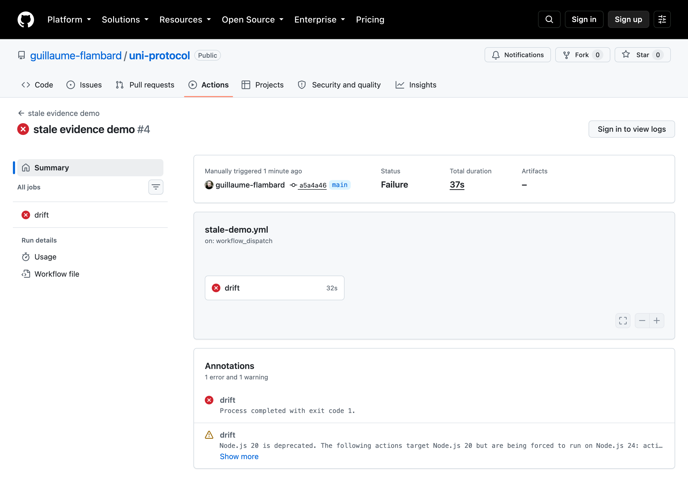
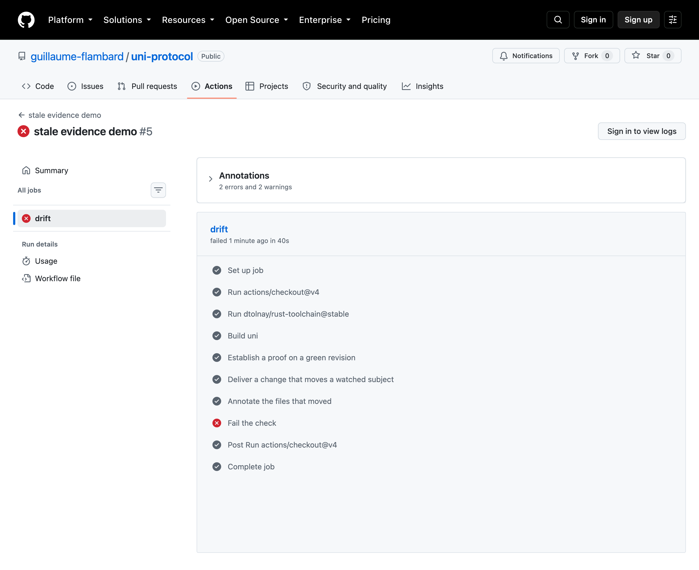

# The check, in the pull request

UNI's whole point is a sentence: *the tests passed, but were they run on what you
are shipping?* This is that sentence as a GitHub check.

`examples/drift-demo/` is a small green repo. The workflow
`.github/workflows/stale-demo.yml` (named `stale evidence demo`) proves it,
then edits the watched file, then verifies again. The second verify is red, and
`uni explain --annotations` puts the reason on the file that moved:



```
1 error and 1 warning

  claim ledger.frozen: src/ledger.rs#L0
  watched subject moved (changed: src/ledger.rs) (subject_changed); run `uni verify ledger.frozen`
```

One annotation per moved file, and one per claim that moved on it: the CRITICAL
claim lands as an `::error`, a non-critical one as a `::warning`.

The step order is the argument: prove, drift, annotate, then fail.



## Why this is not a lint

A linter reports a rule violation in the current bytes. This reports that a proof
made on one revision was carried to another, and names the dimension: here both
`uncommitted_changes` and `subject_changed`, with `src/ledger.rs` as the file
that moved. The same command also emits `commit_changed`, `contract_changed`,
`verifier_config_changed` when the trusted registry changed (the run says
`REGISTRY_CHANGED` and requires a human reread), `authorization_changed` when the
reviewed binding no longer resolves, and `expired` when a time-boxed fact aged
out.

The annotation is a `::error` for a `CRITICAL` claim and a `::warning` otherwise,
always with `file=` set to the file that moved, so GitHub renders it inline on
the diff. One annotation per file, with the reason that names it: a reason like
"tracked files were modified" that carries no path does not get a duplicate note
on the workflow file.

## Run it yourself

```bash
gh workflow run stale-demo.yml --ref main
```

It is manual and it is meant to fail: it breaks its own artifact on purpose, so
running it on every push would leave a permanent red check. Its value is as a
reproducible demonstration, and as the shape you copy into a real pipeline: run
`uni verify`, and on failure run `uni explain --annotations` and fail the job.

## In a real pipeline

```yaml
- run: uni verify c.uni
- if: failure()
  run: |
    uni explain --annotations
    uni explain >> "$GITHUB_STEP_SUMMARY"
- if: failure()
  run: exit 1
```

That is exactly what the published composite action
(`adapters/github/action.yml`) does: verify, and on failure annotate the drift and
append the plain-word narration to the job summary.
